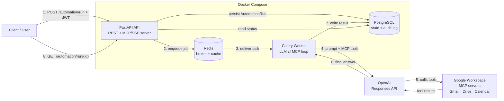
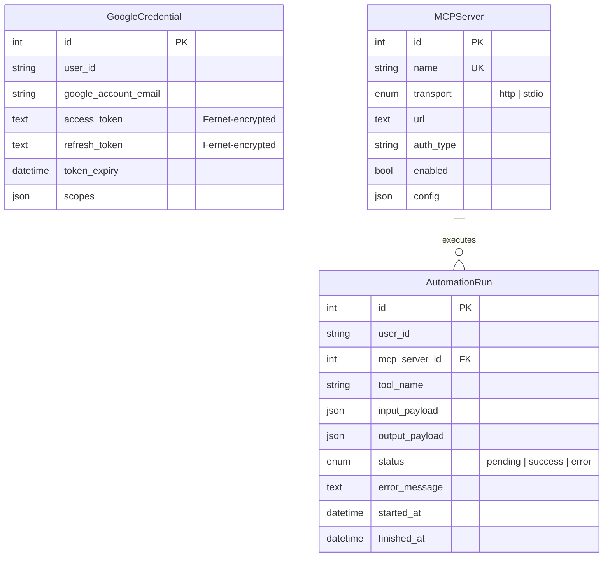

# MCP Automation Service

A production-grade **AI automation backend** that lets a Large Language Model safely operate real-world tools — Gmail, Google Drive, and Calendar — through the **Model Context Protocol (MCP)**.

The service acts as a secure broker between an LLM and external systems: it stores per-user OAuth credentials (encrypted at rest), exposes its own database as an MCP server, and runs long LLM↔tool conversations in background workers so the API stays responsive.

> **In one sentence:** a user says *"summarise last week's invoice emails"*, and the system orchestrates OpenAI + the Gmail MCP server to do it — asynchronously, auditably, and securely.

---

## Table of Contents

- [Architecture](#architecture)
- [Request Lifecycle](#request-lifecycle)
- [Why This Design](#why-this-design)
- [Technology Stack](#technology-stack)
- [Data Model](#data-model)
- [Security Model](#security-model)
- [Getting Started](#getting-started)
- [API Reference](#api-reference)
- [Testing](#testing)
- [Project Structure](#project-structure)

---

## Architecture

The system is built as four independent, containerised services. The **API** never blocks on an LLM call — it validates, persists a job, and hands off to a **Celery worker**, which drives the LLM↔MCP loop and writes results back to PostgreSQL.



### Components

| Service | Responsibility | Why it exists |
|---|---|---|
| **`api`** (FastAPI) | REST endpoints, Google OAuth, JWT auth, MCP server over SSE | The only public surface; stays fast by never running LLM work inline |
| **`worker`** (Celery) | Runs the LLM↔MCP conversation, refreshes tokens, writes results | LLM loops are slow (30–120 s) and stateful — they belong off the request path |
| **`postgres`** | Stores users' encrypted credentials, the MCP server registry, and a full execution audit log | Durable state and traceability of every AI action |
| **`redis`** | Message broker between API and worker | Decouples request acceptance from execution |

### Two directions of MCP

This project demonstrates **both** roles MCP can play:

1. **MCP client (consume):** the LLM connects *out* to Google's MCP servers to use Gmail/Drive/Calendar as tools.
2. **MCP server (expose):** the service exposes its *own* data (`/mcp/`) so other AI agents can query automation runs and the server registry.

---

## Request Lifecycle

A single automation run flows through the system as follows:

1. **Accept** — `POST /automation/run` validates the JWT and the target MCP server, writes an `AutomationRun` row with `status=pending`, and returns `202 Accepted` with a `run_id` immediately.
2. **Enqueue** — the API dispatches a Celery task carrying only the `run_id` (never ORM objects), and returns control to the client.
3. **Authorise** — the worker loads the user's `GoogleCredential`, decrypts the token, and refreshes it against Google if it expires within 5 minutes.
4. **Orchestrate** — the worker calls the OpenAI Responses API, passing the MCP servers as `tools`. OpenAI's infrastructure connects to the MCP servers, invokes tools, and returns a final answer.
5. **Persist** — the worker records the output (and any tool calls) on the `AutomationRun` row, setting `status=success` / `error` and `finished_at`.
6. **Poll** — the client retrieves the result via `GET /automation/run/{id}`, scoped to its own user.

---

## Why This Design

| Decision | Rationale |
|---|---|
| **Async work in Celery, not request handlers** | An LLM↔tool loop can take minutes. Running it inline would exhaust web workers and time out clients. The API returns in milliseconds. |
| **Pass `run_id` to tasks, never ORM objects** | SQLAlchemy objects aren't JSON-serialisable and become stale across process boundaries. The worker re-fetches with its own session. |
| **Tokens encrypted with Fernet** | A database leak must not expose usable Google credentials. Plaintext tokens are the single highest-risk mistake in this class of system. |
| **JWT validated *before* the SSE handshake** | The MCP stream is registered as a FastAPI route (not `app.mount()`) so dependency-injected auth runs before any data flows. |
| **OpenAI Responses API with remote MCP tools** | OpenAI's infrastructure executes the MCP tool calls, so no bespoke MCP client protocol code is needed in the worker. |
| **`expire_on_commit=False` on the async session** | Prevents lazy-load failures when attributes are accessed after `commit()` in async contexts. |
| **`acks_late` + `prefetch_multiplier=1`** | Long tasks are re-queued (not lost) if a worker crashes, and fairly distributed across workers. |

---

## Technology Stack

| Layer | Choice |
|---|---|
| Web framework | **FastAPI** + **Uvicorn** (async ASGI) |
| LLM orchestration | **OpenAI** Responses API (remote MCP tools) |
| Protocol | **Model Context Protocol** (`mcp[cli]`, HTTP/SSE transport) |
| Background jobs | **Celery** + **Redis** |
| Database | **PostgreSQL** + **SQLAlchemy 2.0** (async) + **Alembic** |
| Auth | **Google OAuth2** (`authlib`, `google-auth-oauthlib`) + **JWT** (`python-jose`) |
| Encryption | **Fernet** (`cryptography`) |
| Config | **pydantic-settings** (12-factor `.env`) |
| Packaging | **Docker** (multi-stage) + **Docker Compose** |

---

## Data Model



- **`GoogleCredential`** — per-user OAuth tokens, stored encrypted, refreshed automatically.
- **`MCPServer`** — registry of MCP servers the system can connect to.
- **`AutomationRun`** — an append-only audit log of every AI action: what was asked, what ran, what came back.

---

## Security Model

- **Encryption at rest** — access and refresh tokens are Fernet-encrypted; the database never holds plaintext credentials.
- **Authenticated MCP** — every MCP/SSE connection requires a valid Bearer JWT, validated before the stream opens.
- **User isolation** — run-status endpoints enforce ownership; a user cannot read another user's runs.
- **Least-privilege OAuth** — only the Google scopes actually needed are requested.
- **Secret hygiene** — all secrets load from `.env` (git-ignored); production deployments should use a secrets manager (Vault, AWS Secrets Manager) for `FERNET_KEY` and `SECRET_KEY`.
- **Prompt-injection awareness** — because MCP tools can fetch external content, write-capable scopes should be granted deliberately.

---

## Getting Started

### Prerequisites
- Docker + Docker Compose v2
- A Google Cloud project with OAuth credentials
- An OpenAI API key

### 1. Google Cloud setup
1. In [Google Cloud Console](https://console.cloud.google.com), create a project.
2. Enable the **Gmail API**, **Google Drive API**, and **Google Calendar API**.
3. Configure the **OAuth consent screen** (External) with scopes: `gmail.readonly`, `gmail.send`, `drive.file`, `calendar.events`.
4. Create an **OAuth 2.0 Client ID** (Web application) with redirect URI `http://localhost:8000/auth/google/callback`.

### 2. Configure environment
```bash
cp .env.example .env
```
Generate the keys and fill in your credentials:
```bash
# JWT signing key
openssl rand -hex 32

# Fernet encryption key
python -c "from cryptography.fernet import Fernet; print(Fernet.generate_key().decode())"
```
Then set `GOOGLE_CLIENT_ID`, `GOOGLE_CLIENT_SECRET`, and `OPENAI_API_KEY` in `.env`.

### 3. Launch
```bash
docker compose up --build       # starts postgres, redis, api, worker
docker compose exec api alembic upgrade head
```

### 4. Connect a Google account
Open `http://localhost:8000/auth/google/login`, grant access, and receive a JWT:
```json
{ "access_token": "eyJ...", "token_type": "bearer" }
```

### 5. Register an MCP server
```sql
INSERT INTO mcp_servers (name, transport, url, auth_type, enabled, config)
VALUES ('gmail', 'http', 'https://gmail.googleapis.com/mcp', 'oauth', true, '{}');
```

### 6. Trigger an automation run
```bash
curl -X POST http://localhost:8000/automation/run \
  -H "Authorization: Bearer <your-jwt>" \
  -H "Content-Type: application/json" \
  -d '{
    "mcp_server_id": 1,
    "tool_name": "search_emails",
    "instructions": "Find all emails from last week about invoices and summarise them"
  }'
# → 202 { "run_id": 1, "status": "pending" }

curl http://localhost:8000/automation/run/1 -H "Authorization: Bearer <your-jwt>"
```

---

## API Reference

Interactive docs (Swagger UI): **`http://localhost:8000/docs`**

| Method | Path | Auth | Description |
|--------|------|------|-------------|
| GET | `/health` | — | Liveness check |
| GET | `/auth/google/login` | — | Begin Google OAuth flow |
| GET | `/auth/google/callback` | — | OAuth callback → issues JWT |
| POST | `/automation/run` | JWT | Enqueue an automation run |
| GET | `/automation/run/{id}` | JWT | Poll a run's status/result |
| GET | `/automation/runs` | JWT | List the user's recent runs |
| GET | `/mcp/` | JWT | MCP server stream (SSE) |
| POST | `/mcp/messages/` | — | MCP message relay |

**Exposed MCP tools:** `get_automation_runs`, `get_mcp_servers`, `get_run_detail`

---

## Testing

```bash
pip install -r requirements.txt aiosqlite
pytest tests/ -v
```

Coverage focuses on the highest-risk logic:
- **`test_security.py`** — Fernet encrypt/decrypt round-trips, tamper detection, JWT creation/expiry/signature validation, and config-time key validation.
- **`test_tool_logging.py`** — run creation, pending→success/error transitions, `finished_at` stamping, and cross-user access isolation.

---

## Project Structure

```
.
├── docker-compose.yml          # api · worker · postgres · redis
├── Dockerfile                  # multi-stage build (shared by api & worker)
├── alembic/                    # database migrations
└── app/
    ├── main.py                 # FastAPI app + MCP route mounting + lifespan
    ├── api/
    │   ├── auth.py             # Google OAuth → JWT
    │   └── automation.py       # run endpoints (enqueue + poll)
    ├── core/
    │   ├── config.py           # pydantic-settings
    │   ├── db.py               # async SQLAlchemy engine/session
    │   └── security.py         # Fernet + JWT
    ├── mcp/
    │   ├── server.py           # MCP server (tools + SSE transport)
    │   └── client.py           # token refresh + MCP tool config builder
    ├── models/                 # GoogleCredential · MCPServer · AutomationRun
    └── workers/
        ├── celery_app.py       # Celery configuration
        └── tasks.py            # the LLM ⇄ MCP orchestration loop
```

---

> **Note on scaling:** MCP sessions are persisted in RAM per API instance. In a multi-instance deployment, enable session affinity (sticky sessions) at the load balancer so a client always reaches the same `api` node.
