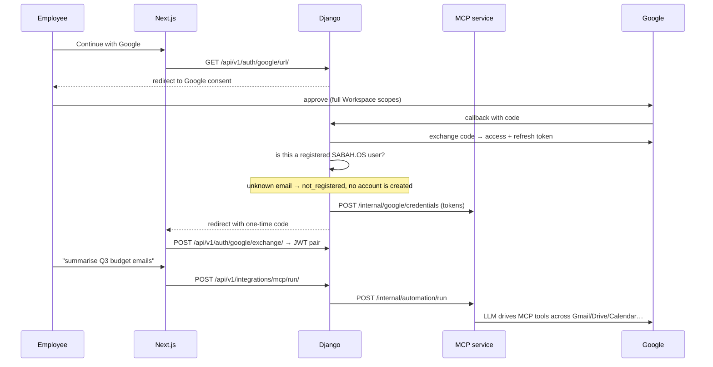
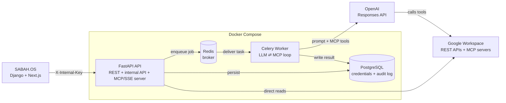
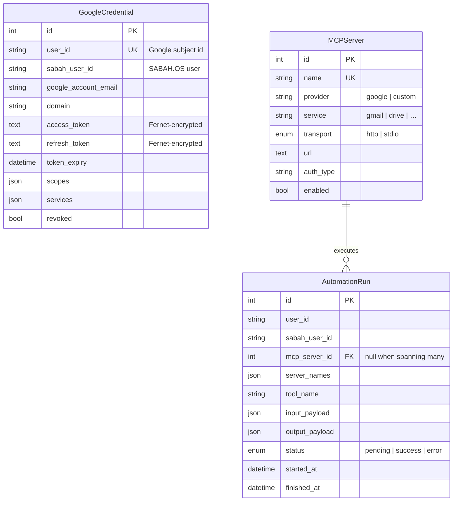

# MCP Automation Service

The Google Workspace brain behind **SABAH.OS**. It holds each employee's corporate
Google credential, reads their entire Workspace on demand, and drives long
LLM ⇄ tool conversations over the **Model Context Protocol (MCP)**.

This is an **internal, corporate deployment**: every user is an employee signing in
with a company Google account, so a single consent screen requests the full
Workspace scope set — Gmail, Drive, Calendar, Docs, Sheets, Slides, Contacts,
Tasks, Forms, Chat and Meet — and the platform can then read everything that
employee owns.

> **In one sentence:** an employee clicks *Continue with Google* in SABAH.OS once,
> and from then on can ask *"summarise every email and document about the Q3 budget"*
> — asynchronously, auditably, and with tokens encrypted at rest.

---

## Table of Contents

- [How it fits with SABAH.OS](#how-it-fits-with-sabahos)
- [Architecture](#architecture)
- [Request Lifecycle](#request-lifecycle)
- [Why This Design](#why-this-design)
- [Technology Stack](#technology-stack)
- [Data Model](#data-model)
- [Security Model](#security-model)
- [Getting Started](#getting-started)
- [Deploying on the company server](#deploying-on-the-company-server)
- [API Reference](#api-reference)
- [Testing](#testing)
- [Project Structure](#project-structure)

---

## How it fits with SABAH.OS

Three services, one flow:

| Service | Owns | Talks to |
|---|---|---|
| **SABAH.OS frontend** (Next.js) | The UI, including *Continue with Google* and the Integrations page | Django |
| **SABAH.OS backend** (Django) | User identity, registration, permissions, the Google OAuth exchange | This service, over `/internal/*` with a shared key |
| **MCP Automation Service** (FastAPI, this repo) | Google credentials, Workspace data access, the LLM ⇄ MCP loop | Google APIs, Google MCP servers, OpenAI |

Django is the authority on **who** may sign in. This service is the authority on
**what** their Google account can do. Neither trusts the browser.



**Sign-in never provisions.** An employee who has not registered in SABAH.OS is
turned away with `not_registered` and sent to the registration page — role,
department and permissions are assigned deliberately, not inferred from a Google
account. Once registered, Google sign-in **skips the OTP step**: Google has already
verified the identity, so a second factor by email adds friction, not security.

---

## Architecture

Four containerised services. The **API** never blocks on an LLM call — it validates,
persists a job, and hands off to a **Celery worker**, which drives the LLM ⇄ MCP loop
and writes results back to PostgreSQL.



### Two directions of MCP

1. **MCP client (consume):** the LLM connects *out* to Google's MCP servers to use
   Workspace services as tools.
2. **MCP server (expose):** this service exposes its own data *and the signed-in
   employee's whole Workspace* at `/mcp/`, so other AI agents can query it —
   `google_workspace_snapshot` and `google_read` are MCP tools, not just REST routes.

### Three ways to reach Google data

| Path | Route | Use when |
|---|---|---|
| **Direct read** | `POST /google/read`, `GET /google/gmail/messages`, … | You know exactly what you want. No LLM cost, millisecond latency. |
| **Passthrough** | `POST /google/passthrough` | Google shipped an endpoint this service doesn't wrap yet. Host-allowlisted. |
| **LLM automation** | `POST /automation/run` | The question needs reasoning across services. Optional — see below. |

> **The LLM is optional.** `OPENAI_API_KEY` is the only reason this service talks
> to a model provider, and it powers exactly one endpoint. Leave it empty and
> `POST /automation/run` returns `503`; direct reads, passthrough, OAuth and the
> MCP server this app exposes are all unaffected. The `openai` package is
> likewise not in `requirements.txt` — install it only when enabling the feature.
>
> Worth knowing before you enable it: the loop uses OpenAI's *remote MCP* tools,
> so the employee's live Google access token is sent to OpenAI and Workspace
> content is read through their infrastructure.

---

## Request Lifecycle

1. **Accept** — `POST /automation/run` validates the JWT, resolves the target MCP
   servers (or all enabled Google servers), writes an `AutomationRun` with
   `status=pending`, and returns `202 Accepted` immediately.
2. **Enqueue** — the API dispatches a Celery task carrying only the `run_id`.
3. **Authorise** — the worker loads the `GoogleCredential`, decrypts it, and refreshes
   the access token if it expires within 5 minutes.
4. **Orchestrate** — the worker calls the OpenAI Responses API with the MCP servers
   as `tools`. OpenAI's infrastructure connects to them and invokes the tools.
5. **Persist** — output and every tool call are written to the run row.
6. **Poll** — the client reads `GET /automation/run/{id}`, scoped to its own user.

---

## Why This Design

| Decision | Rationale |
|---|---|
| **Django decides identity, this service decides capability** | One system owns the employee record; one owns the Google grant. Neither has to re-implement the other. |
| **Authorization-code flow, not one-tap ID tokens** | Only the code flow returns a refresh token. Without one, Workspace access would die an hour after sign-in. |
| **Full Workspace scope in one consent** | Internal deployment. Incremental per-service consent would mean an employee hitting a Google screen every time a new feature touches a new service. |
| **Corporate domain gate in both services** | Django checks it, this service checks it again. A misconfiguration on one side cannot open the platform to arbitrary Google accounts. |
| **Async work in Celery, not request handlers** | An LLM ⇄ tool loop can take minutes; running it inline would exhaust web workers and time out clients. |
| **Pass `run_id` to tasks, never ORM objects** | SQLAlchemy objects aren't JSON-serialisable and go stale across process boundaries. |
| **Tokens encrypted with Fernet** | A database leak must not hand anyone a working corporate refresh token. |
| **Permanent failures don't retry** | A revoked Google grant fails identically on every attempt; retrying it three times just delays the error the user needs to see. |
| **MCP tools scoped by a context variable** | MCP has no per-call identity. The JWT subject validated at the SSE handshake is what every tool filters on — a tool argument never decides whose data is read. |
| **JWT validated *before* the SSE handshake** | The MCP stream is a FastAPI route (not `app.mount()`) so dependency-injected auth runs before any data flows. |
| **`acks_late` + `prefetch_multiplier=1`** | Long tasks are re-queued (not lost) if a worker crashes. |

---

## Technology Stack

| Layer | Choice |
|---|---|
| Web framework | **FastAPI** + **Uvicorn** (async ASGI) |
| LLM orchestration | **OpenAI** Responses API (remote MCP tools) — *optional, off by default* |
| Protocol | **Model Context Protocol** (`mcp[cli]`, HTTP/SSE transport) |
| Background jobs | **Celery** + **Redis** |
| Database | **PostgreSQL** + **SQLAlchemy 2.0** (async) + **Alembic** |
| Auth | **Google OAuth2** (`google-auth-oauthlib`) + **JWT** (`python-jose`) |
| Encryption | **Fernet** (`cryptography`) |
| Config | **pydantic-settings** (12-factor `.env`, production-validated) |
| Packaging | **Docker** (multi-stage) + **Docker Compose** |

---

## Data Model



- **`GoogleCredential`** — one row per Google account, encrypted, auto-refreshed,
  linked to a SABAH.OS user.
- **`MCPServer`** — registry of MCP servers. Google's are seeded automatically on
  first boot; disabling or repointing one survives restarts.
- **`AutomationRun`** — append-only audit log of every AI action.

---

## Security Model

- **Corporate gate** — `ALLOWED_EMAIL_DOMAINS` is enforced at OAuth callback *and*
  at credential push. Production refuses to boot with an empty list.
- **Encryption at rest** — access and refresh tokens are Fernet-encrypted.
- **Production config validation** — the app will not start in production with a
  placeholder `SECRET_KEY`, a missing `FERNET_KEY`/`INTERNAL_API_KEY`, a plaintext
  `PUBLIC_BASE_URL`, or `"*"` in `ALLOWED_ORIGINS`.
- **Signed, single-purpose OAuth state** — the `state` is a short-lived signed token
  carrying the redirect target; a tampered or expired one is rejected.
- **Internal API** — `/internal/*` needs `X-Internal-Key` (constant-time compare),
  is excluded from the OpenAPI schema, and should also be IP-restricted at nginx.
- **Host allowlist for passthrough** — the generic Google proxy can only reach
  `*.googleapis.com` hosts on an explicit list; a corporate token can never be sent
  elsewhere.
- **User isolation** — run endpoints enforce ownership, on the internal API too.
- **No docs in production** — `/docs`, `/redoc` and `/openapi.json` are disabled when
  `ENVIRONMENT=production`.
- **Prompt-injection awareness** — MCP tools fetch external content; write-capable
  scopes should be granted deliberately.

---

## Getting Started

### Prerequisites
- Docker + Docker Compose v2
- A Google Cloud project in the company Workspace organisation
- An OpenAI API key

### 1. Google Cloud setup
1. In [Google Cloud Console](https://console.cloud.google.com), create a project
   **inside the company organisation**.
2. Enable the APIs you intend to read: Gmail, Drive, Calendar, Docs, Sheets, Slides,
   People, Tasks, Forms, Chat, Meet.
3. Configure the **OAuth consent screen** as **Internal** — this is what limits
   sign-in to the company Workspace and removes Google's verification requirement
   for sensitive scopes.
4. Create an **OAuth 2.0 Client ID** (Web application). Add both redirect URIs:
   - `https://mcp.your-domain.com/auth/google/callback` (this service)
   - `https://api.your-domain.com/api/v1/auth/google/callback/` (SABAH.OS Django)

### 2. Configure environment
```bash
cp .env.example .env
```
Generate the secrets:
```bash
openssl rand -hex 32                                                          # SECRET_KEY
python -c "from cryptography.fernet import Fernet; print(Fernet.generate_key().decode())"   # FERNET_KEY
python -c "from app.core.config import generate_internal_key as g; print(g())"              # INTERNAL_API_KEY
```
Then set `GOOGLE_CLIENT_ID`, `GOOGLE_CLIENT_SECRET`, and `ALLOWED_EMAIL_DOMAINS`.
`OPENAI_API_KEY` stays empty unless you want `POST /automation/run` — enabling it
also needs `pip install "openai>=1.68.0,<2.0.0"`.

> `INTERNAL_API_KEY` here must equal `MCP_INTERNAL_API_KEY` in the SABAH.OS Django `.env`.

### 3. Launch
```bash
docker compose up --build       # postgres, redis, api, worker
```
Migrations run automatically (`RUN_MIGRATIONS=true` on the api container), and the
Google MCP server registry is seeded on first boot.

### 4. Connect a Google account
Open `http://localhost:8000/auth/google/login`, approve, and the browser lands on
`FRONTEND_REDIRECT_URL` with a JWT. In normal operation SABAH.OS drives this — you
only need it to test the service standalone.

### 5. Read data
```bash
curl http://localhost:8000/google/snapshot -H "Authorization: Bearer <jwt>"

curl -X POST http://localhost:8000/automation/run \
  -H "Authorization: Bearer <jwt>" -H "Content-Type: application/json" \
  -d '{"instructions": "Summarise last week'\''s invoice emails"}'
# → 202 { "run_id": 1, "status": "pending" }
```

---

## Deploying on the company server

```bash
git clone <this repo> /opt/mcp && cd /opt/mcp
cp .env.example .env          # fill in real secrets, ENVIRONMENT=production
docker compose -f docker-compose.prod.yml up -d --build
docker compose -f docker-compose.prod.yml logs -f api
```

Then put nginx in front:

```bash
sudo cp deploy/nginx.conf /etc/nginx/sites-available/mcp
sudo ln -s /etc/nginx/sites-available/mcp /etc/nginx/sites-enabled/mcp
sudo certbot --nginx -d mcp.your-domain.com
sudo nginx -t && sudo systemctl reload nginx
```

What the production stack changes:

- Postgres and Redis are **not** published to the host — compose network only.
- The API binds to `127.0.0.1:8000`; nginx terminates TLS.
- `/internal/` is IP-restricted in nginx *in addition to* the `X-Internal-Key` check.
- Log rotation (10 MB × 3) and `restart: always` on every service.
- One uvicorn worker per api container.

**Scaling:** MCP SSE sessions live in the API process's memory. To run more than one
API container, add each to the `ip_hash` upstream in `deploy/nginx.conf` so a client
always reaches the node holding its session.

**Health:** `GET /health` is liveness, `GET /ready` also checks the database.

**Backups:** the only irreplaceable state is Postgres (`pgdata`). A lost `FERNET_KEY`
makes every stored credential unreadable — back it up separately from the database,
or every employee must reconnect.

---

## API Reference

Interactive docs (non-production only): `http://localhost:8000/docs`

### Public / user-facing (JWT)

| Method | Path | Description |
|--------|------|-------------|
| GET | `/health`, `/ready` | Liveness / readiness |
| GET | `/auth/google/url` | Consent URL |
| GET | `/auth/google/login` | Begin OAuth (redirect) |
| GET | `/auth/google/callback` | OAuth callback → redirects to the frontend |
| GET | `/auth/google/status` | Is this user's Google account connected? |
| POST | `/auth/google/disconnect` | Revoke at Google and locally |
| GET | `/auth/google/services` | Services this deployment requests |
| GET | `/google/resources` | Every readable resource name |
| POST | `/google/read` | Read one named resource |
| GET | `/google/snapshot` | Everything at once, bounded |
| GET | `/google/profile` | Google profile |
| GET | `/google/gmail/messages` | Mail search |
| GET | `/google/drive/files` | File search |
| GET | `/google/calendar/events` | Events |
| GET | `/google/contacts` | Contacts or company directory |
| GET | `/google/tasks` | Task lists / tasks |
| POST | `/google/passthrough` | Authorised call to any allowlisted Google host |
| GET | `/automation/servers` | Registered MCP servers |
| POST | `/automation/run` | Queue an LLM ⇄ MCP run (`503` when no LLM is configured) |
| GET | `/automation/run/{id}` | Poll a run |
| GET | `/automation/runs` | List your runs |
| GET | `/mcp/` | MCP server stream (SSE) |
| POST | `/mcp/messages/` | MCP message relay |

### Internal (SABAH.OS Django only — `X-Internal-Key`)

| Method | Path | Description |
|--------|------|-------------|
| POST | `/internal/google/credentials` | Push a user's Google tokens |
| GET | `/internal/google/credentials/{user}` | Connection status |
| DELETE | `/internal/google/credentials/{user}` | Disconnect |
| GET | `/internal/google/auth-url` | Consent URL bound to a SABAH.OS user |
| GET | `/internal/google/services` | Service catalogue |
| POST | `/internal/google/read` | Read a resource for a user |
| POST | `/internal/automation/run` | Queue a run for a user |
| GET | `/internal/automation/runs` | List a user's runs |
| GET | `/internal/automation/run/{id}` | Poll a run |
| GET | `/internal/health` | Dependency check |

**Resource names** accepted by `/google/read` and `/internal/google/read`:
`profile`, `snapshot`, `gmail.messages`, `gmail.labels`, `gmail.send`, `drive.files`,
`drive.file`, `drive.export`, `calendar.list`, `calendar.events`, `docs.document`,
`sheets.values`, `sheets.metadata`, `slides.presentation`, `contacts.list`,
`contacts.directory`, `tasks.lists`, `tasks.items`, `forms.responses`, `chat.spaces`,
`chat.messages`, `meet.records`.

**Exposed MCP tools:** `get_automation_runs`, `get_mcp_servers`, `get_run_detail`,
`google_workspace_snapshot`, `google_read`.

---

## Testing

```bash
python3.12 -m venv .venv && .venv/bin/pip install -r requirements.txt aiosqlite
.venv/bin/python -m pytest tests/ -v
```

Coverage focuses on the highest-risk logic:

- **`test_security.py`** — Fernet round-trips, tamper detection, JWT creation/expiry/
  signature validation, config-time key validation.
- **`test_tool_logging.py`** — run creation, pending→success/error transitions,
  `finished_at` stamping, cross-user access isolation.
- **`test_corporate_google.py`** — the scope catalogue, the corporate domain gate,
  production config refusal, internal-API authentication, encrypted credential
  upsert (including Google omitting the refresh token on re-consent), MCP server
  seeding, and resource dispatch.

---

## Project Structure

```
.
├── docker-compose.yml          # dev: api · worker · postgres · redis
├── docker-compose.prod.yml     # company server: loopback-bound, log-rotated
├── Dockerfile                  # multi-stage build (shared by api & worker)
├── docker/entrypoint.sh        # wait for DB → migrate (api only) → exec
├── deploy/nginx.conf           # TLS, SSE tuning, /internal IP restriction
├── alembic/                    # database migrations
└── app/
    ├── main.py                 # FastAPI app, routers, lifespan, health/ready
    ├── api/
    │   ├── auth.py             # Google OAuth → JWT, corporate gate
    │   ├── google.py           # direct Workspace data access
    │   ├── internal.py         # service-to-service API for Django
    │   └── automation.py       # run endpoints (enqueue + poll)
    ├── core/
    │   ├── config.py           # pydantic-settings + production validation
    │   ├── db.py               # async SQLAlchemy engine/session
    │   ├── google_scopes.py    # service catalogue, scopes, host allowlist
    │   ├── google_client.py    # refresh, authorised requests, revocation
    │   └── security.py         # Fernet, JWT, OAuth state, internal key
    ├── services/
    │   └── google_data.py      # per-service readers + resource dispatch
    ├── mcp/
    │   ├── server.py           # MCP server (tools + SSE transport)
    │   └── client.py           # server registry + tool config builder
    ├── models/                 # GoogleCredential · MCPServer · AutomationRun
    └── workers/
        ├── celery_app.py       # Celery configuration
        └── tasks.py            # the LLM ⇄ MCP orchestration loop
```
